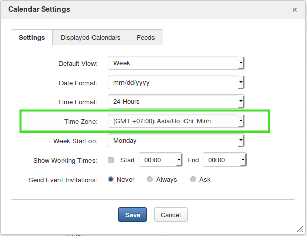
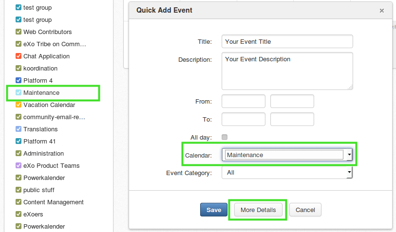
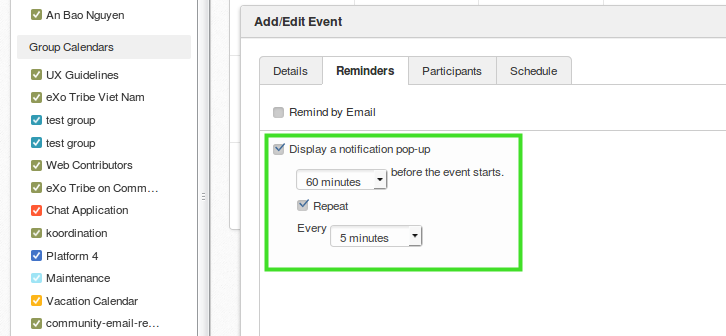

maintenance-warning-addon
=====================

Build
---------------
Simply build it with :

	mvn clean install

Deploy to eXo
---------------
By Add-on Manager:
$ ./addon install exo-maintenance-warning:1.0.0

Prerequisites for Installing Maintenance Warning Addon
---------------
1) Configure your local Time Zone correctly with Tomcat server

2) A calendar group "Maintenance" is already installed you should add your event detail in this group. View only for all Platform users, modify for administrators.

3) As an adminstrator, choose More Details then check "Display a notification pop-up" and "Repeat", then choose your preferences time. 

